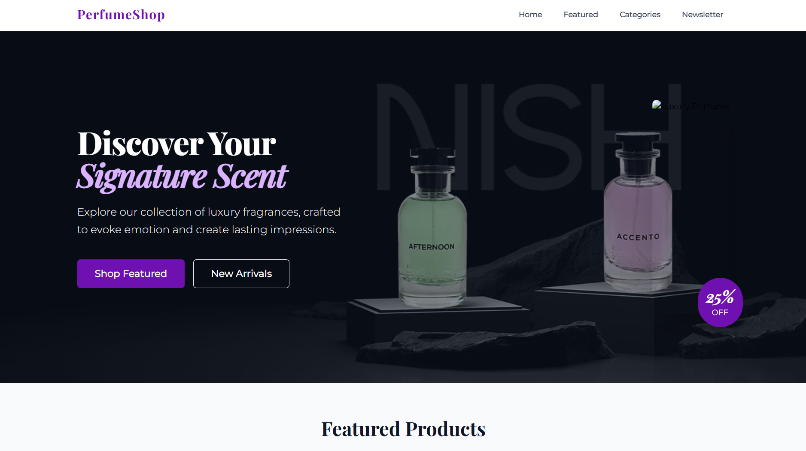

# Perfume Shop

A full-stack e-commerce application for selling premium perfumes, built with React, Node.js, Express, and MongoDB.



## Table of Contents

-   [Project Overview](#project-overview)
-   [Features](#features)
-   [Project Structure](#project-structure)
-   [Technology Stack](#technology-stack)
-   [Installation](#installation)
-   [Configuration](#configuration)
-   [Usage](#usage)
-   [API Documentation](#api-documentation)
-   [Database Schema](#database-schema)
-   [Frontend Architecture](#frontend-architecture)
-   [Code Style & Standards](#code-style--standards)
-   [Testing](#testing)
-   [Deployment](#deployment)
-   [Performance Optimization](#performance-optimization)
-   [Contributing](#contributing)
-   [License](#license)
-   [Acknowledgments](#acknowledgments)

## Project Overview

Perfume Shop is a complete e-commerce solution for a luxury perfume boutique. It offers a seamless shopping experience with an elegant user interface, efficient API, and robust database management. The application allows customers to browse through collections of high-end fragrances, view detailed product information, read and submit reviews, and navigate different perfume categories.

### Key Highlights

-   **Responsive Design**: Fully responsive UI that works perfectly on all devices from mobile to desktop
-   **Category-Based Navigation**: Browse perfumes by men's, women's, and unisex categories
-   **Product Details**: Comprehensive product pages with image galleries and detailed descriptions
-   **Review System**: User-generated reviews and ratings for authentic product feedback
-   **Performance Optimized**: Fast loading times with optimized frontend and backend components

## Features

### Homepage

-   **Navigation Bar**: Responsive navbar with smooth scrolling to sections
-   **Hero Banner**: Eye-catching banner with call-to-action
-   **Featured Products Section**: Showcase of popular and trending fragrances
-   **Categories Section**: Visual navigation to men's, women's, and unisex collections
-   **Newsletter Signup**: Email subscription form for promotional updates
-   **Footer**: Site navigation, social media links, and company information

### Category Pages

-   **Filtered Product Display**: Products filtered by men's, women's, or unisex categories
-   **Responsive Grid Layout**: Adapts to different screen sizes for optimal viewing
-   **Loading States**: Visual feedback during data fetching
-   **Error Handling**: User-friendly error messages if products can't be retrieved

### Product Details Page

-   **Product Information**: Complete details including name, brand, price, and description
-   **Image Gallery**: Multiple product images with interactive navigation
-   **Size Selection**: Options for different perfume volumes
-   **Customer Reviews**: Display of user reviews with star ratings
-   **Review Submission**: Interface for submitting new product reviews
-   **Social Sharing**: Buttons to share products on social media
-   **Related Products**: Suggestions based on the current product

### UI Components

-   **Product Cards**: Visually appealing cards with hover effects
-   **Loading Indicators**: Spinners and skeletons for loading states
-   **Error Messages**: Styled error notifications
-   **Breadcrumb Navigation**: Contextual path indicators
-   **Scroll-to-Top Button**: One-click navigation to page top

## Project Structure

The application follows a clean, modular architecture divided into client and server components:

```
perfume-shop/
├── README.md                # Project documentation
├── client/                  # Frontend React application
│   ├── public/              # Static files
│   └── src/                 # Source code
│       ├── api/             # API service modules
│       ├── assets/          # Images and static resources
│       ├── components/      # Reusable UI components
│       │   ├── layouts/     # Page layout components
│       │   ├── navigation/  # Navigation components
│       │   ├── products/    # Product-related components
│       │   ├── sections/    # Page section components
│       │   └── ui/          # Generic UI components
│       ├── hooks/           # Custom React hooks
│       ├── pages/           # Page components
│       └── App.jsx          # Main application component
└── server/                  # Backend Express application
    ├── config/              # Configuration files
    ├── controllers/         # Request handlers
    ├── middleware/          # Express middlewares
    ├── models/              # Mongoose database models
    ├── routes/              # API route definitions
    └── server.js            # Server entry point
```

## Technology Stack

### Frontend

-   **React**: Component-based UI library
-   **React Router**: Client-side routing
-   **Tailwind CSS**: Utility-first CSS framework
-   **Axios**: Promise-based HTTP client
-   **Vite**: Next-generation frontend tooling

### Backend

-   **Node.js**: JavaScript runtime
-   **Express**: Web application framework
-   **MongoDB**: NoSQL database
-   **Mongoose**: MongoDB object modeling
-   **dotenv**: Environment variable management

## Installation

### Prerequisites

-   Node.js (v16.0.0 or higher)
-   MongoDB (local installation or MongoDB Atlas account)
-   npm (v8.0.0 or higher) or yarn

### Step 1: Clone the Repository

```bash
git clone https://github.com/yourusername/perfume-shop.git
cd perfume-shop
```

### Step 2: Install Dependencies

For both client and server:

```bash
# Install root dependencies
npm install

# Install client dependencies
cd client
npm install

# Install server dependencies
cd ../server
npm install
```

Or use the convenience script:

```bash
npm run install-all
```

## Configuration

### Server Environment Variables

Create a `.env` file in the server directory with the following variables:

```
NODE_ENV=development
PORT=5000
MONGO_URI=mongodb://localhost:27017/perfume_shop
```

### Client Environment Variables

Create a `.env` file in the client directory:

```
VITE_API_URL=http://localhost:5000/api
```

## Usage

### Database Seeding

To populate your database with initial product and review data:

```bash
cd server
npm run seed
```

### Development Mode

Run both the client and server concurrently:

```bash
# From the root directory
npm run dev
```

Or run them separately:

```bash
# Run server only
npm run server

# Run client only
npm run client
```

### Production Build

```bash
# Build the client
cd client
npm run build

# Start the production server
cd ../server
npm start
```

## API Documentation

### Base URL

```
http://localhost:5000/api
```

### Authentication

The API currently operates without authentication for demonstration purposes.

### Endpoints

#### Products

| Method | Endpoint                 | Description                                 |
| ------ | ------------------------ | ------------------------------------------- |
| GET    | /products                | Get all products                            |
| GET    | /products/:id            | Get a single product by ID                  |
| GET    | /products/featured       | Get featured products                       |
| GET    | /products/category/:name | Get products by category (men/women/unisex) |

#### Reviews

| Method | Endpoint             | Description                        |
| ------ | -------------------- | ---------------------------------- |
| GET    | /reviews/product/:id | Get reviews for a specific product |
| POST   | /reviews/product/:id | Create a new review for a product  |

### Response Format

Success response:

```json
{
    "_id": "60d21b4667d0d8992e610c85",
    "name": "Chanel No. 5",
    "brand": "Chanel",
    "category": "women",
    "price": 108.99,
    "description": "A classic floral fragrance..."
}
```

Error response:

```json
{
    "message": "Product not found"
}
```

## Database Schema

### Product Model

```javascript
{
  name: String,
  brand: String,
  category: String,
  price: Number,
  description: String,
  sizes: [
    {
      value: String,
      unit: String,
      price: Number
    }
  ],
  images: [String],
  featured: Boolean,
  inStock: Boolean,
  rating: Number,
  numReviews: Number,
  createdAt: Date
}
```

### Review Model

```javascript
{
  name: String,
  rating: Number,
  comment: String,
  product: ObjectId (ref: 'Product'),
  createdAt: Date
}
```

## Frontend Architecture

### Component Structure

The frontend follows a modular component architecture:

-   **Layouts**: Define the overall page structure
-   **Pages**: Represent different routes in the application
-   **Sections**: Major page segments (e.g., Hero, Featured Products)
-   **UI Components**: Reusable interface elements

### Routing

React Router v7 is used for client-side routing with the following main routes:

-   `/`: Homepage
-   `/product/:id`: Product details page
-   `/category/men`: Men's perfumes page
-   `/category/women`: Women's perfumes page
-   `/category/unisex`: Unisex perfumes page

### State Management

State is managed using React hooks, primarily:

-   `useState`: For component-level state
-   `useEffect`: For side effects like data fetching
-   Custom hooks: For reusable logic across components

### Custom Hooks

-   `useProducts`: Fetches and manages product data
-   `useReviews`: Handles review data and submission
-   `useScrollToSection`: Manages smooth scrolling to page sections

## Code Style & Standards

The project follows consistent coding conventions:

### JavaScript/React

-   ES6+ syntax
-   Functional components with hooks
-   JSX for templating
-   Component-per-file structure

### CSS

-   Tailwind CSS for styling
-   Responsive design with mobile-first approach
-   BEM naming convention for custom CSS

## Testing

### Unit Testing

To run tests:

```bash
cd client
npm run test
```

### Linting

```bash
npm run lint
```

## Deployment

### Client Deployment

The React application can be deployed to services like Netlify, Vercel, or GitHub Pages:

```bash
cd client
npm run build
```

This generates a `dist` folder that can be deployed to any static hosting service.

### Server Deployment

The Node.js server can be deployed to platforms like Heroku, Railway, or AWS:

1. Set up necessary environment variables on the platform
2. Configure the build process to include both client and server
3. Ensure MongoDB connection is properly configured for production

## Performance Optimization

The application implements several optimization techniques:

-   **Code Splitting**: Lazy loading of routes
-   **Image Optimization**: Appropriate sizing and formats
-   **Caching**: API response caching
-   **Pagination**: For large data sets
-   **Lazy Loading**: For images and components

## Contributing

Contributions are welcome! Please follow these steps:

1. Fork the repository
2. Create a feature branch (`git checkout -b feature/amazing-feature`)
3. Commit your changes (`git commit -m 'Add some amazing feature'`)
4. Push to the branch (`git push origin feature/amazing-feature`)
5. Open a Pull Request

## License

This project is for demonstration purposes only and is not licensed for commercial use.

## Acknowledgments

-   Images sourced from [Unsplash](https://unsplash.com/)
-   Icons from [Heroicons](https://heroicons.com/)
-   UI inspiration from premium perfume retailers
-   Special thanks to all contributors and reviewers
